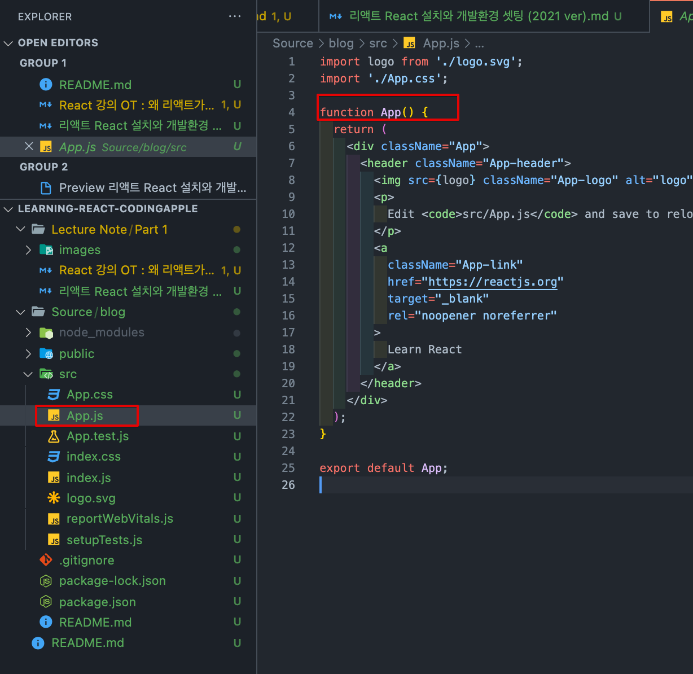
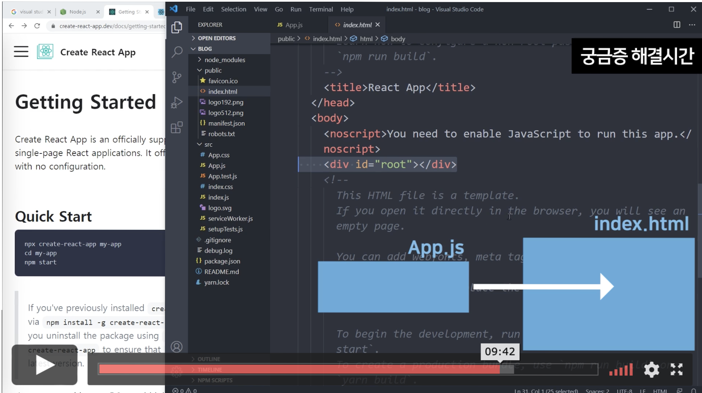
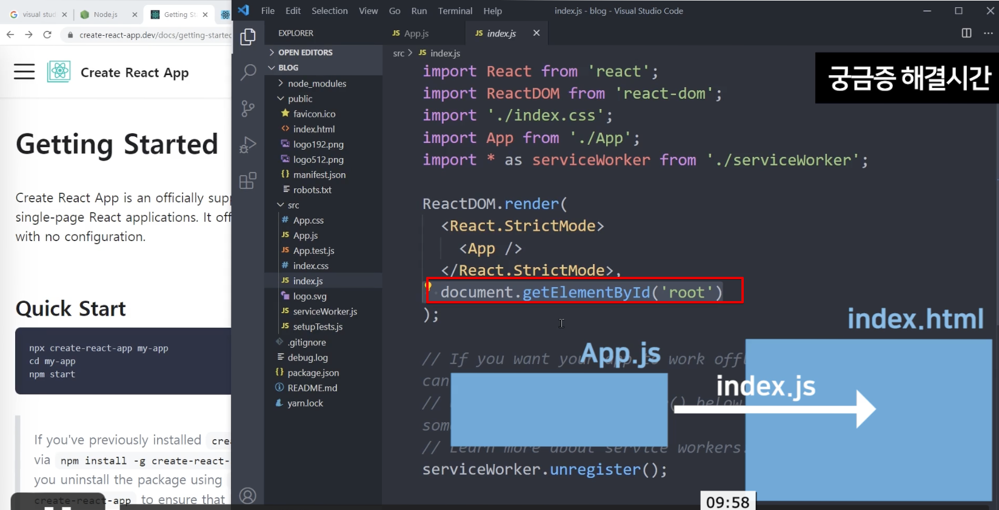

# Setting up React dev environment(local)

## Setup environment

### Version

- {
  npm: '8.3.0',
  node: '17.3.0',
  v8: '9.6.180.15-node.12',
  uv: '1.42.0',
  zlib: '1.2.11',
  brotli: '1.0.9',
  ares: '1.18.1',
  modules: '102',
  nghttp2: '1.45.1',
  napi: '8',
  llhttp: '6.0.4',
  openssl: '3.0.1+quic',
  cldr: '40.0',
  icu: '70.1',
  tz: '2021a3',
  unicode: '14.0',
  ngtcp2: '0.1.0-DEV',
  nghttp3: '0.1.0-DEV'
  }

- Node.js v17.3.0
- Mac OS M1 air

### Boiler plate code

- npx create-react-app \<name of your app>

### Available commands

```shell
Inside that directory, you can run several commands:

  npm start
    Starts the development server.

  npm run build
    Bundles the app into static files for production.

  npm test
    Starts the test runner.

  npm run eject
    Removes this tool and copies build dependencies, configuration files
    and scripts into the app directory. If you do this, you can’t go back!

We suggest that you begin by typing:

  cd blog
  npm start
```

### Running Project in local

1. Move to root directory of your project (in this case : blog)
2. npm Start

### Main Page


</br>

</br>


- Using _`JSX`_, public/index.html is generated from _`app.js`_ through _`index.js`_
- Node_modules : Libraries to run react
- Public : Static files for static files
  - Additional build files will be generated and stored here when the React app is built
- Package.js : Version control for library for npm

### Work Flow

1. Nodejs install -> Npm package is included(for Framework installation)
2. under npm, create-react-app is available
